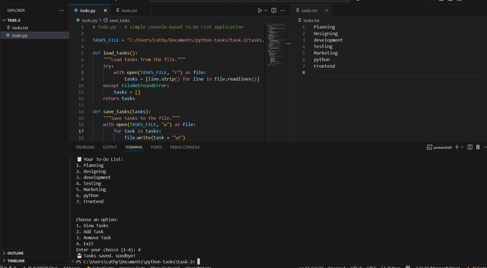

# **Todo-list-App**
A simple console-based To-Do List app built using Python.

## 🚀 Features
- Add tasks
- View tasks
- Remove tasks
- Stores tasks in a text file (`tasks.txt`) for persistence

## 📁 How to Run

```bash
python todo.py
```

## 💾 Requirements
Python 3

## 📄 File Structure

todo.py         # Main app file <br>
tasks.txt       # Task storage (auto-created)

## ✅ Example

Choose an option:
1. View Tasks
2. Add Task
3. Remove Task
4. Exit

## 📸 Screenshot

Here's a sample run of the application:


